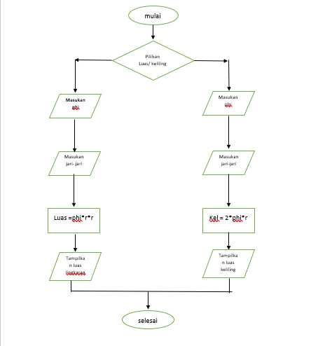
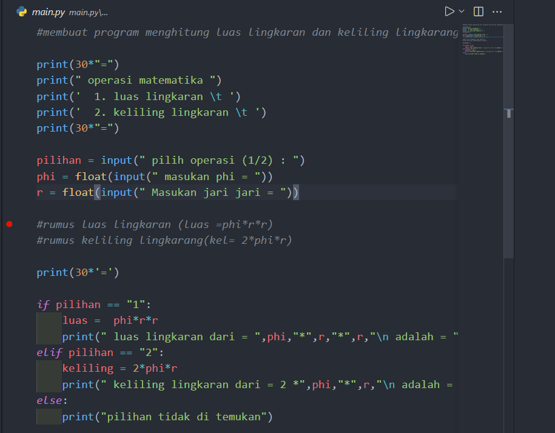
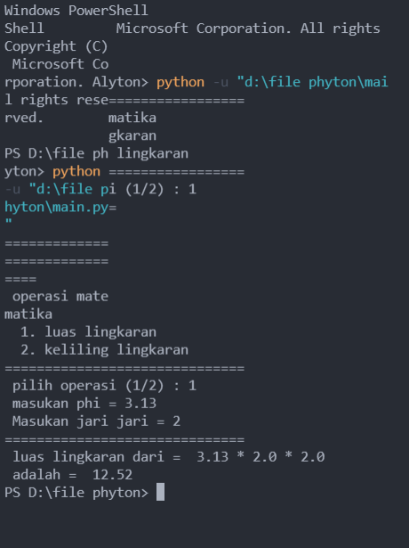

# python2
operasi python menghitung luas lingkarang dan keliling lingkaran
================================================================

 * INI KERANGKA PROGRAMNYA / FLOWCART 
 * PROGRAM YANG SAYA BUAT MENGGUNAKAN KONDISI IF, ELIF DAN ELSE

================================================================

* IDLE YANG SAYA GUNAKAN YA ITU VSCODE
* MENGAPA VSCODE ? KARNA SANGAT MEMBATU DALAM PENGERJAAN  PROJECT

================================================================

* INI HASIL OUTPUT DARI PROGRAM PYHTON SAYA

